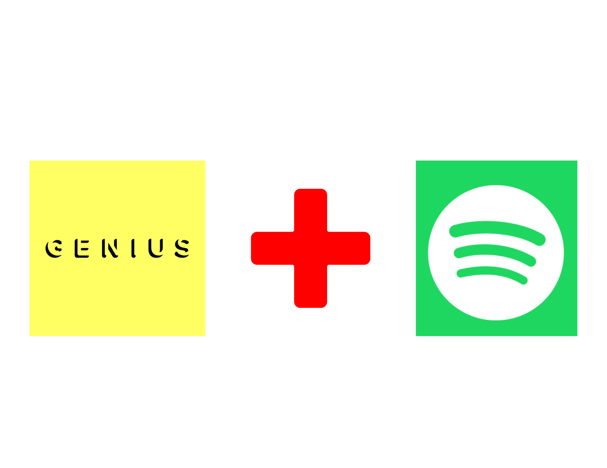

# Song_Genre_Prediction

The goal of this project is to develop a machine-learning model that predicts the genre of a song based on a given set of lyrics.
We train our model on a kaggle dataset as well as a custom dataset generated using Spotify + Genius Lyrics 

# Setup # 

## Testing the model 
1. Clone this repo 
2. Install required dependancies 
3. Run the ___ file to test 

## Generating the Dataset 
1. Open the custom_dataset_generator.ipynb file 
2. Install required dependencies 
3. Run all the cells 
4. The final output is a csv file called custom_dataset.csv 

Note: If you would like to create a dataset using a different playlist update the TOP_SONGS_URI variable to be the URI for Spotify playlist. More info can be found here: https://misswood.us/pages/como-conseguir-el-codigo-uri-en-spotify

# Credit # 
1. For spotify API calls - https://developer.spotify.com/
2. For Genuis lyrics https://lyricsgenius.readthedocs.io/en/master/- 
3. Playlist used - https://open.spotify.com/playlist/5ABHKGoOzxkaa28ttQV9sE

Note: The genre's given to each song is the genre of the artist.

](images/Genuis_Spot_2.png)